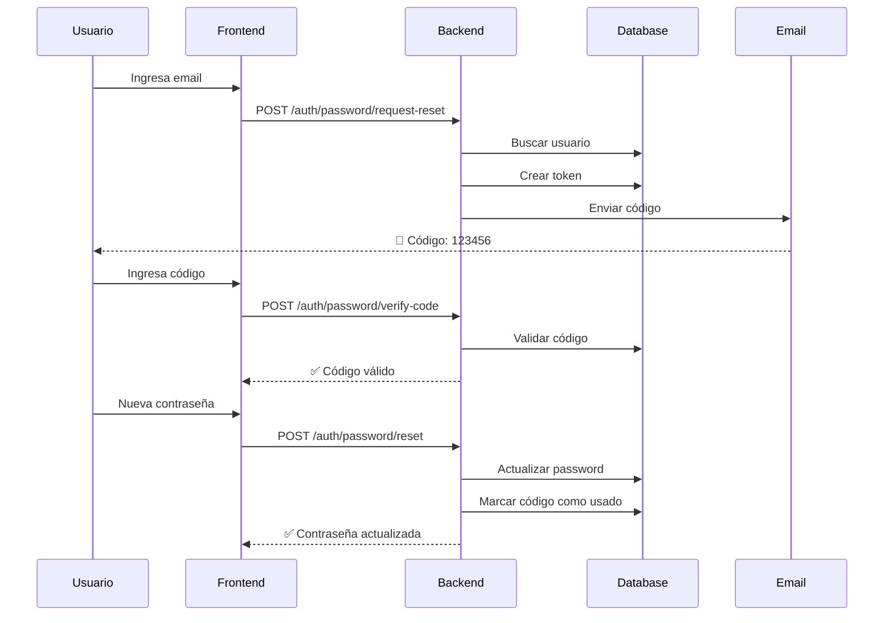

# 🔐 Sistema de Recuperación de Contraseña

Sistema completo y profesional de recuperación de contraseña con código de verificación enviado por email.

---

## 📋 CARACTERÍSTICAS

✅ Envío de código de 6 dígitos por email
✅ Códigos con expiración de 15 minutos
✅ Validación de códigos antes de cambiar contraseña
✅ Prevención de enum

eration de emails (seguridad)
✅ Invalidación automática de códigos usados
✅ Limpieza automática de tokens expirados
✅ Plantilla HTML profesional para emails
✅ Soporte para modo desarrollo (loguea códigos si no hay email configurado)

---

## 🗄️ BASE DE DATOS

### Tabla: `password_recovery_tokens`

```sql
CREATE TABLE password_recovery_tokens (
    id UUID PRIMARY KEY DEFAULT gen_random_uuid(),
    user_id UUID NOT NULL REFERENCES users(id) ON DELETE CASCADE,
    token VARCHAR(6) NOT NULL,
    expires_at TIMESTAMP NOT NULL,
    used BOOLEAN DEFAULT FALSE,
    created_at TIMESTAMP DEFAULT CURRENT_TIMESTAMP,
    used_at TIMESTAMP
);

-- Índices para performance
CREATE INDEX idx_recovery_token ON password_recovery_tokens(token);
CREATE INDEX idx_recovery_user_id ON password_recovery_tokens(user_id);
CREATE INDEX idx_recovery_expires ON password_recovery_tokens(expires_at);
```

---

## 🔌 ENDPOINTS

### 1. Solicitar recuperación de contraseña

**POST** `/auth/password/request-reset`

**Body:**
```json
{
  "email": "usuario@example.com"
}
```

**Respuesta exitosa (200):**
```json
{
  "message": "Si el email existe, recibirás un código de recuperación"
}
```

**Notas de seguridad:**
- Siempre devuelve el mismo mensaje, exista o no el email
- Esto previene que atacantes descubran qué emails están registrados
- Si no hay configuración de email, el código se loguea en consola (solo desarrollo)

---

### 2. Verificar código de recuperación

**POST** `/auth/password/verify-code`

**Body:**
```json
{
  "email": "usuario@example.com",
  "code": "123456"
}
```

**Respuesta exitosa (200):**
```json
{
  "valid": true,
  "message": "Código verificado correctamente"
}
```

**Errores posibles:**
- `404`: Usuario no encontrado
- `400`: Código inválido
- `400`: Código ya utilizado
- `400`: Código expirado

---

### 3. Resetear contraseña

**POST** `/auth/password/reset`

**Body:**
```json
{
  "email": "usuario@example.com",
  "code": "123456",
  "newPassword": "nuevaPassword123"
}
```

**Respuesta exitosa (200):**
```json
{
  "message": "Contraseña actualizada exitosamente"
}
```

**Errores posibles:**
- `404`: Usuario no encontrado
- `400`: Código inválido o expirado

**Validaciones:**
- Email debe ser válido
- Código debe tener exactamente 6 caracteres
- Nueva contraseña debe tener al menos 6 caracteres

---

## 📧 CONFIGURACIÓN DE EMAIL

### Variables de Entorno Requeridas

Agrega estas variables a tu `.env`:

```env
# Email Configuration (for password recovery)
EMAIL_USER=tu_email@gmail.com
EMAIL_PASSWORD=tu_app_password
```

### Para Gmail:

1. Ve a tu cuenta de Google: https://myaccount.google.com
2. Seguridad → Verificación en 2 pasos (actívala si no está activa)
3. Contraseñas de aplicaciones → Genera una nueva
4. Usa esa contraseña en `EMAIL_PASSWORD`

⚠️ **NO uses tu contraseña regular de Gmail, usa una "App Password"**

### Para otros proveedores de email:

Modifica el servicio en `src/common/email/email.service.ts`:

```typescript
this.transporter = nodemailer.createTransport({
  host: 'smtp.tuproveedor.com',
  port: 587,
  secure: false, // true para port 465
  auth: {
    user: emailUser,
    pass: emailPass,
  },
});
```

---

## 🎨 PLANTILLA DE EMAIL

El email enviado incluye:

- 📧 Diseño profesional en HTML
- 🔢 Código de 6 dígitos destacado
- ⏰ Indicación de expiración (15 minutos)
- ⚠️ Advertencias de seguridad
- 🎨 Colores corporativos (#d32f2f - rojo)

Vista previa del email:

```
┌─────────────────────────────────┐
│  🔒 Recuperación de Contraseña  │
├─────────────────────────────────┤
│                                 │
│  Hola {username},               │
│                                 │
│  Tu código de verificación es:  │
│                                 │
│     ╔═══════════╗               │
│     ║  123456   ║               │
│     ╚═══════════╝               │
│                                 │
│  Este código expira en 15 min   │
│                                 │
│  ⚠️ Nunca compartas este código │
│                                 │
└─────────────────────────────────┘
```

---

## 🔒 SEGURIDAD

### Medidas implementadas:

1. **Prevención de Email Enumeration**
   - Siempre devuelve el mismo mensaje, exista o no el email

2. **Expiración de Códigos**
   - Códigos válidos solo por 15 minutos
   - Se invalidan automáticamente al usarse

3. **Un Código a la Vez**
   - Al solicitar nuevo código, los anteriores se invalidan

4. **Validación Estricta**
   - Código debe ser exactamente 6 dígitos
   - Email debe ser válido
   - Password mínimo 6 caracteres

5. **Hash de Contraseñas**
   - Nuevas contraseñas se hashean con bcrypt (10 rounds)

6. **Limpieza Automática**
   - Método para limpiar tokens expirados: `cleanupExpiredTokens()`

---

## 🔄 FLUJO COMPLETO



---

## 🧪 TESTING

### Modo Desarrollo (sin email configurado)

Si `EMAIL_USER` y `EMAIL_PASSWORD` no están configurados:

1. El sistema NO enviará emails reales
2. Los códigos se loguean en la consola del backend
3. Busca en los logs: `🔑 Recovery code for email@example.com: 123456`

### Ejemplo de testing manual:

```bash
# 1. Solicitar código
curl -X POST http://localhost:3000/auth/password/request-reset \
  -H "Content-Type: application/json" \
  -d '{"email":"adalberto@example.com"}'

# 2. Verificar código (usa el código que aparece en los logs)
curl -X POST http://localhost:3000/auth/password/verify-code \
  -H "Content-Type: application/json" \
  -d '{"email":"adalberto@example.com","code":"123456"}'

# 3. Resetear contraseña
curl -X POST http://localhost:3000/auth/password/reset \
  -H "Content-Type: application/json" \
  -d '{
    "email":"adalberto@example.com",
    "code":"123456",
    "newPassword":"newPass123"
  }'
```

---

## 📂 ARCHIVOS CREADOS

### Backend

```
src/
├── common/
│   └── email/
│       ├── email.module.ts          # Módulo de email
│       └── email.service.ts         # Servicio de envío de emails
│
└── modules/
    └── auth/
        ├── entities/
        │   └── password-recovery-token.entity.ts   # Entidad de tokens
        ├── dto/
        │   ├── request-password-reset.dto.ts       # DTO solicitar reset
        │   ├── verify-reset-code.dto.ts            # DTO verificar código
        │   └── reset-password.dto.ts               # DTO resetear password
        ├── auth.service.ts          # Lógica de recuperación
        ├── auth.controller.ts       # Endpoints HTTP
        └── auth.module.ts           # Módulo actualizado
```

---

## 🚀 DESPLEGAR A RENDER

### Variables de Entorno en Render:

Agrega estas dos variables adicionales en Render Dashboard:

```
EMAIL_USER=tu_email@gmail.com
EMAIL_PASSWORD=tu_app_password
```

⚠️ **Sin estas variables, los emails NO se enviarán** (pero el código se loguea en consola para desarrollo).

---

## 🔄 LIMPIEZA AUTOMÁTICA

Para limpiar códigos expirados, puedes crear un cron job:

```typescript
// En un servicio de cron (por ejemplo, usando @nestjs/schedule)
@Cron('0 0 * * *') // Cada día a medianoche
async cleanupExpiredTokens() {
  await this.authService.cleanupExpiredTokens();
}
```

O ejecutarlo manualmente cuando sea necesario:

```typescript
await authService.cleanupExpiredTokens();
```

---

## 📊 MÉTRICAS Y MONITOREO

Logs importantes que el sistema genera:

```
✅ Recovery code sent to email@example.com
❌ Failed to send email to email@example.com
🔑 Recovery code for email@example.com: 123456 (solo en desarrollo)
⚠️  Password reset requested for non-existent email: fake@example.com
✅ Password reset successful for user: username
🧹 Cleaned up 42 expired recovery tokens
```

---

## ✅ CHECKLIST DE IMPLEMENTACIÓN

### Backend:
- [x] Tabla `password_recovery_tokens` creada
- [x] Entidad `PasswordRecoveryToken` creada
- [x] DTOs de validación creados
- [x] `EmailService` implementado
- [x] `EmailModule` creado
- [x] Métodos en `AuthService` implementados
- [x] Endpoints en `AuthController` agregados
- [x] `AuthModule` actualizado con dependencias
- [x] Variables de entorno documentadas en `.env.example`
- [x] Build exitoso

### Frontend (Flutter):
- [ ] Pantalla "Olvidé mi contraseña"
- [ ] Pantalla "Ingresar código de verificación"
- [ ] Pantalla "Establecer nueva contraseña"
- [ ] Integración con endpoints del backend
- [ ] Manejo de errores y validaciones
- [ ] UX/UI profesional

---

## 📞 PRÓXIMOS PASOS

1. **Configurar email** en variables de entorno
2. **Implementar frontend** en Flutter
3. **Probar flujo completo** end-to-end
4. **Opcional:** Agregar rate limiting para prevenir spam
5. **Opcional:** Agregar captcha en la solicitud de recuperación

---

**Fecha de implementación**: 2025-10-24
**Estado**: ✅ Backend completado - Frontend pendiente
**Tecnologías**: NestJS, TypeORM, Nodemailer, PostgreSQL
